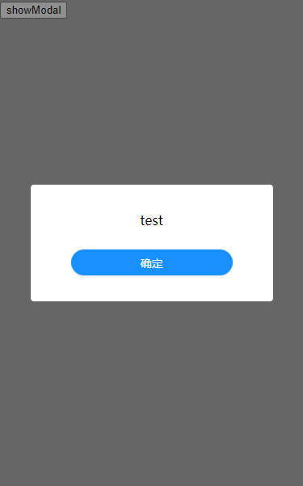

# Vue 自定义模态框插件

## 引入插件

```js
import Vue from 'vue'
import Modal from '../components/Modal'

Vue.use(Modal)
```

## 基本使用

```html
<template>
  <div>
    <button @click="showModal">showModal</button>
  </div>
</template>
```

```js

export default {
  data() {
    return {}
  },
  methods: {
    showModal() {
      this.$modal({
        title: 'test'
      })
    }
  }
}
```



## API
| 参数 | 说明 | 类型 | 默认值 |
| -- | -- | -- | -- |
| maskClosable | 点击蒙层是否关闭 | `Boolean` | `false` |
| okText | 确认按钮文字 | `string` | `'确定'` |
| title | 标题 | `string` | `''` |

## 下一个版本

* 支持 `content` 模态框正文内容
* 支持 `slot` 自定义内容
* 增加关闭按钮，以及 `closable` 参数控制其显示